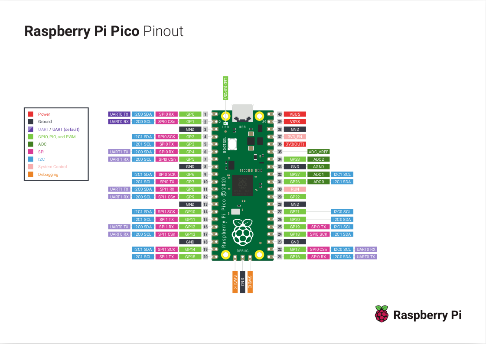

## API Design Notes

### Pin Modes

If you look at the Pico pin-out diagram, you will see that a GPIO pin may be 
configured to operate in one of several operational modes. 



No matter the mode, when using Telemetrix, you must first explicitly set the mode 
by calling one of the _set_pin_mode_XXX_ methods for the pin. For output modes, if you try 
to perform a _write_ operation and have not first set the pin's mode, a RunTimeError 
exception is thrown.

### Callbacks

When you set a pin mode for input, a callback function is required to be registered to 
notify 
the application of any data changes on the pin.  

**Telemetrix does not support polling or direct 
read methods for inputs. Instead, as soon as a data change is detected, 
the pin's associated callback is called, allowing for immediate response to data 
changes, and in general, simpler application design.**

When you create a callback function, you must specify a single input
parameter. The client automatically fills in this parameter in the form of a list
describing the data change.

The list contents vary from input pin type to input pin type and 
are described in detail for each _set_pin_mode_XXX_ method in the
[API documentation.](https://htmlpreview.github.io/?https://github.com/MrYsLab/tmx-pico-aio/blob/master/examples/digital_input_pullup.py) 
The first element in the list identifies the pin type, and the last element
is a timestamp of the data change occurrence. Other elements identify the GPIO pin, 
and the current data value, in addition to any additional relevant information.

#### Pin Types

|                    Pin Mode                   | Pin Mode Value |
|:---------------------------------------------:|:--------------:|
| Digital Input (including pullup and pulldown) |        2       |
|               Analog Input (ADC)              |        3       |
|                    i2c Read                   |       10       |
|                    SONAR Distance             |       11       |
|                    DHT                        |       12       |

#### Converting The Raw Timestamp

To convert the raw timestamp field to a human-readable time, use **time.localtime()**.

### Registering A Callback
The line below establishes GPIO pin 12 as a digital input pin with pull-ups enabled and
associates a user-provided function, named **_the_callback_** to be called whenever 
the state of pin 12 changes.

```python
await board.set_pin_mode_digital_input_pullup(12, the_callback)
```

### A Callback Function Example

Here is the implementation for the callback method that services pin 12. 
It prints out a notification of the change to the console. Your callback function may do 
something like store the latest value or perhaps issue a command to control on an LED 
or other device. 

**NOTE:** The callback function is blocking, so you will want to keep it as short as 
possible. If you need to do some extended processing, you may want to create a 
separate thread so that your application may proceed.

```python

async def the_callback(data):
    """
    A callback function to report data changes.
    This will print the pin number, its reported value and
    the date and time when the change occurred

    :param data: [pin mode, pin, current reported value, pin_mode, timestamp]
    """
    date = time.strftime('%Y-%m-%d %H:%M:%S', time.localtime(data[CB_TIME]))
    print(f'Report Type: {data[CB_PIN_MODE]} Pin: {data[CB_PIN]} '
          f'Value: {data[CB_VALUE]} Time Stamp: {date}')

```

And here is the output printed by the callback function:
```python
Report Type: 2 Pin: 12 Value: 1 Time Stamp: 2021-03-15 16:41:08
```

<br>
<br>

Copyright (C) 2021 Alan Yorinks. All Rights Reserved.