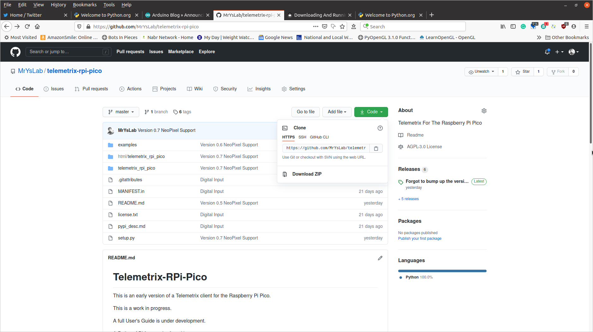

Go to the [Github repository](https://github.com/MrYsLab/telemetrix-rpi-pico) 
and click on the _green_ button in upper right and 
download the zip file.

Next, expand the zip file and go to the [_examples_](https://github.com/MrYsLab/telemetrix-rpi-pico/tree/master/examples) 
directory. Select any of the examples that you wish to 
run. 

 
 

Copyright (C) 2021 Alan Yorinks. All Rights Reserved.